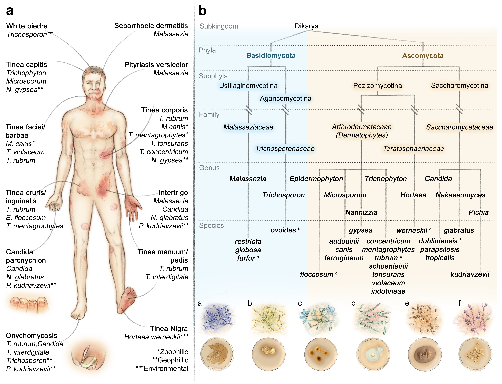

# Comparative genomics of clinical fungi

Analyses and data related to the manuscript: 

"Comparative genomic analysis of clinically relevant human skin-associated fungi" - 
[Preprint](https://doi.org/10.21203/rs.3.rs-6700810/v1) 

Comparative genomic analysis of 32 human skin-associated clinically relevant fungal species and 6 outgroup species.
We focuse on orthogroup composition, functional annotation, and secretome characterisation.

  

### Overview

This repository contains scripts and curated data for:

1. **Genome assembly preparation and gene prediction** using Funannotate
2. **Functional annotation** with InterProScan, EggNOG-mapper, SignalP, TMHMM, and NetGPI
3. **Orthogroup analysis** via OrthoFinder and IQ-tree, including gene copy number variation across species
4. **Secretome characterisation** - identification and categorisation of secreted proteins (signal peptide-positive, no transmembrane domains, no GPI-anchor)
5. **Statistical testing** of gene content differences across taxonomic levels

### Repository structure

```
scripts/           Shell and Python scripts for the bioinformatics pipeline,
                   and R Markdown notebooks for analysis and visualisation
generated/         Curated data tables and summary files used by the analysis notebooks
```

#### Pipeline scripts (shell/Python)

| Script | Description |
|--------|-------------|
| `asm_prep.sh` | Assembly cleaning, sorting, and repeat masking (funannotate) |
| `gene_pred.sh` | Ab initio gene prediction (funannotate predict) |
| `run_ipr.sh` | InterProScan functional annotation |
| `run_funannotate_annotate.sh` | Funannotate annotation with InterProScan results |
| `busco.sh` | BUSCO completeness assessment on protein sets |
| `run_signalp.sh` | SignalP6 signal peptide prediction |
| `get_signalp_genes.py` | Extract SignalP-positive gene sequences |
| `exclude_tmhmm.py` | Filter out genes with transmembrane helices |
| `add_signalp_tmhmm_netgpi_to_anno_mat.py` | Merge SignalP, TMHMM, and NetGPI results into annotation matrix |

#### Analysis notebooks (R Markdown)

| Notebook | Description |
|----------|-------------|
| `Stat_visulization.rmd` | BUSCO and assembly statistics visualisation |
| `OG_visu_cleaned.Rmd` | Orthogroup overview: size distributions, species overlap, upset plots |
| `OG_annotation_visu_cleaned.Rmd` | Functional annotation of orthogroups, secretome analysis, metabolism heatmaps |
| `Testing_hypos.Rmd` | Statistical hypothesis testing (Kruskal-Wallis, pairwise comparisons) across taxonomic levels |

#### Curated data files (`generated/`)

| File | Description |
|------|-------------|
| `1211_manual_cur_secreted.xlsx` | Manually curated secreted protein categories |
| `gpi_manual_curated.xlsx` | Manually curated GPI-anchored protein classifications |
| `Pfam-A.clans.tsv` | Pfam clan-to-description mapping (external reference) |
| `busco_visu.xlsx` | BUSCO completeness scores for visualisation |
| `OG_annotation_genecounts.tsv` | Orthogroup-by-sample gene count matrix with functional annotations |
| `species_kegg_category_summary.csv` | KEGG category summary per species |
| `EC_hydrolase_summary.csv` | EC hydrolase class summary per species |
| `plot5_df.csv` | Secreted protein category heatmap data |
| `gpi_plot_df_long.csv` | GPI-anchored protein plot data |

### Species included 

The analysis includes 66 isolates from 38 species across major clinical fungal lineages, including dermatophytes (*Trichophyton*, *Microsporum*, *Epidermophyton*), yeasts (*Candida*, *Nakaseomyces*, *Cryptococcus*, *Malassezia*), and dimorphic/other fungi (*Aspergillus*, *Histoplasma*, *Hortaea*).

### Tools used

- [Funannotate](https://funannotate.readthedocs.io/) - Genome annotation pipeline
- [OrthoFinder](https://github.com/davidemms/OrthoFinder) - Orthogroup inference
- [InterProScan](https://www.ebi.ac.uk/interpro/search/sequence/) - Protein domain annotation
- [EggNOG-mapper](https://github.com/eggnogdb/eggnog-mapper) - Functional annotation
- [SignalP 6.0](https://services.healthtech.dtu.dk/services/SignalP-6.0/) - Signal peptide prediction
- [TMHMM](https://services.healthtech.dtu.dk/services/TMHMM-2.0/) - Transmembrane helix prediction
- [NetGPI](https://services.healthtech.dtu.dk/services/NetGPI-1.1/) - GPI-anchor prediction
- [BUSCO](https://busco.ezlab.org/) - Genome/proteome completeness
- [IQtree3](https://iqtree.github.io) - Phylogenomic inference


// Sofie Agerbaek - soage@regionsjaelland.dk